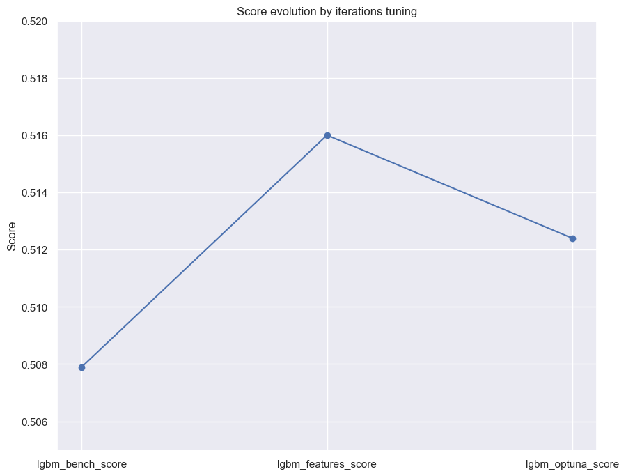
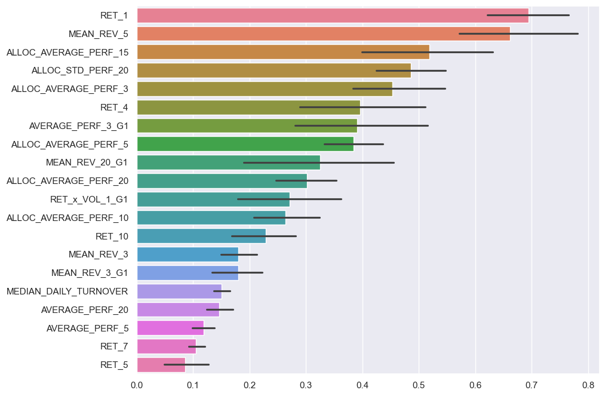
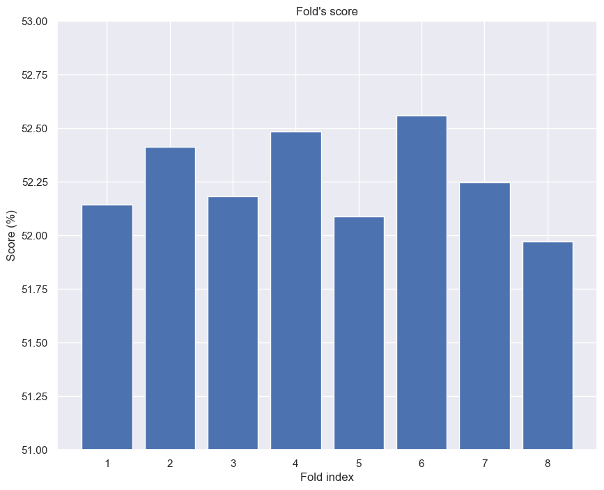
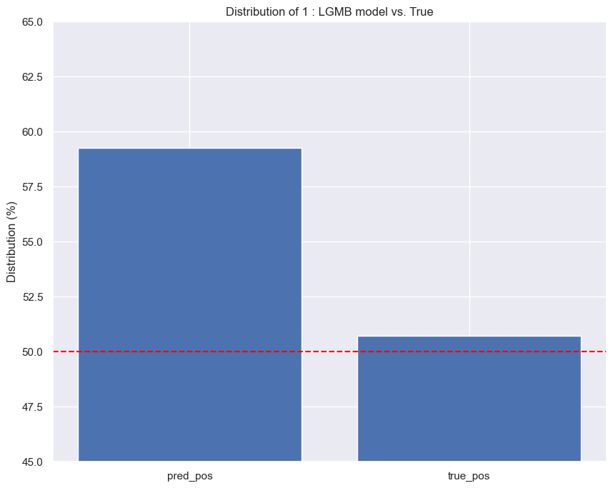

# QRT Data Challenge — ENS × QRT
### Binary Classification of Allocation Returns | Top 50% · Score: 0.5160

---

## Context

This project is based on the [ENS Data Challenge](https://challengedata.ens.fr/challenges/167), organized in partnership with **QRT**, a leading systematic trading fund. The objective is to predict whether an allocation will have a **positive or negative return the next day** — a binary classification problem evaluated on accuracy.

Each row in the dataset represents a (date, allocation) pair and contains:
- 20 days of historical returns (`RET_1` to `RET_20`)
- 20 days of signed volume (`SIGNED_VOLUME_1` to `SIGNED_VOLUME_20`)
- A median daily turnover (`MEDIAN_DAILY_TURNOVER`)
- An anonymized group label (`GROUP` ∈ {1, 2, 3, 4})

The target is the sign of the next-day return. With **527,073 training observations** and **31,870 test observations**, the benchmark LightGBM model achieves **0.5079** — barely above random, which reflects the fundamental difficulty of the problem.

---

## Why Is This Problem Hard?

The core difficulty lies in the **Efficient Market Hypothesis (EMH)**: any publicly available signal in historical prices tends to be arbitraged away by market participants. What remains is close to pure noise, making every tenth of a percentage point in accuracy meaningful.

Two additional constraints amplify this difficulty:
- **Anonymized dates** — temporal continuity cannot be exploited, ruling out standard time-series approaches
- **Extreme signal-to-noise ratio** — the baseline is quasi-random at 0.5079

This framing shapes the entire feature engineering strategy: rather than looking for strong trends, the goal is to extract **weak residual signals** from short-term behavioral patterns.

---

## Exploratory Analysis

Before modeling, key structural properties of the data were examined:

| Property | Value |
|---|---|
| Training observations | 527,073 |
| Unique allocations | 278 |
| Unique timestamps | 2,522 |
| % positive returns (train) | 50.72% |
| % positive SIGNED_VOLUME | 16.17% |

Two findings shaped feature engineering decisions:

**1. Near-balanced target** — No class imbalance issue; a naive "always predict 1" baseline gives 50.72%.

**2. Asymmetric signed volume** — Only 16% of signed volumes are positive, regardless of return direction or group. This strongly limits the informativeness of `RET × SIGNED_VOLUME` interaction features.

---

## Theoretical Hypotheses

Two opposing financial phenomena were tested as signal sources:

**Momentum** — assets that have performed well recently tend to continue performing well. Captured via differences between short-term and long-term average returns (e.g., `AVERAGE_PERF_3 - AVERAGE_PERF_20`).

**Mean-reversion** — assets that spike relative to their historical average tend to revert. Captured via `RET_1 - AVERAGE_PERF_{i}`, measuring how far yesterday's return is from the recent trend.

Feature importance analysis revealed that **mean-reversion dominates**, particularly `MEAN_REV_5` and `RET_1`. Momentum features contributed marginally and were progressively removed. This suggests that allocations exhibit short-term spike-and-revert behavior rather than persistent trends — consistent with a near-efficient market.

---

## Feature Engineering

Features were built in three layers:

**Raw features** (41 features from the dataset)
Returns, signed volumes, turnover, and group label.

**Benchmark features** (12 features, reproduced from the challenge baseline)
- `AVERAGE_PERF_{i}` — rolling mean of returns over windows {3, 5, 10, 15, 20}
- `ALLOC_AVERAGE_PERF_{i}` — cross-allocation mean at each timestamp (global market signal)
- `STD_PERF_20`, `ALLOC_STD_PERF_20` — volatility of the allocation and the market

**Engineered features** (new contributions)
- **Mean-reversion**: `MEAN_REV_{i}` = `RET_1 - AVERAGE_PERF_{i}` for i ∈ {3, 5, 20}
- **Short-term momentum**: `MOMENTUM_3_10` = `AVERAGE_PERF_3 - AVERAGE_PERF_10`
- **GROUP interactions**: `MEAN_REV_{i}_G{g}` and `AVERAGE_PERF_3_G{g}` — the same signal conditioned on the allocation's group, allowing the model to learn group-specific behaviors

**What was tested and removed:**
- `RET × SIGNED_VOLUME` interactions — removed after discovering the asymmetric volume distribution (16% positive), which makes these features uninformative
- Momentum features `AVERAGE_PERF_3 - AVERAGE_PERF_20` — removed after feature importance showed negligible contribution
- Cross-GROUP correlation analysis — GROUP 1 returns show only ~0.10 correlation with other groups at the same timestamp, ruling out lead-lag effects between groups

---

## Modeling

**Model:** LightGBM (Gradient Boosting on decision trees)

**Validation:** 8-fold cross-validation on dates (`shuffle=True` is acceptable since dates are anonymized and temporal order cannot be reconstructed)

**Final hyperparameters:**
```
objective     : mse
learning_rate : 0.01
max_depth     : 3
num_boost_round: 500
```

**Ensemble:** Predictions are averaged across the 8 fold models before thresholding at 0 — this reduces variance and improves robustness.

---

## Results

### Cross-validation (8-fold, best model)

| Fold | Accuracy |
|---|---|
| Fold 1 | 52.14% |
| Fold 2 | 52.41% |
| Fold 3 | 52.18% |
| Fold 4 | 52.49% |
| Fold 5 | 52.09% |
| Fold 6 | 52.56% |
| Fold 7 | 52.25% |
| Fold 8 | 51.97% |
| **Mean** | **52.26% [52.07 ; 52.45] (± 0.19)** |

### Score evolution across iterations



| Model | Public Score |
|---|---|
| Benchmark LightGBM | 0.5079 |
| **LightGBM + Feature Engineering** | **0.5160** |
| LightGBM + Optuna tuning | 0.5124 |

### Public leaderboard
**Rank: 487 / 1,017 — Score: 0.5160**

---

## Feature Importances



The top features confirm the dominance of mean-reversion and global market signals:

- `RET_1` and `MEAN_REV_5` — yesterday's return and its deviation from the 5-day trend are the strongest individual signals
- `ALLOC_AVERAGE_PERF_*` and `ALLOC_STD_PERF_20` — global market context (average return and volatility across all allocations at the same timestamp) consistently ranks highly
- `AVERAGE_PERF_3_G1` and `MEAN_REV_20_G1` — GROUP 1 shows distinctive short-term behavior, suggesting group-specific dynamics

### Fold Stability



Low standard deviation (± 0.19%) across folds confirms the model is stable and not overfitting to specific time periods.

---

## Prediction Bias



The model predicts ~59% positive labels vs. 50.7% in reality. This positive bias is a known artifact of momentum-related features trained on a period with an overall upward market drift. Calibration (e.g., Platt scaling) could partially correct this in a future iteration.

---

## Key Lesson: Hyperparameter Tuning vs. Feature Engineering

Bayesian hyperparameter optimization via **Optuna** (30 trials, 4-fold CV) converged to:
- `max_depth=5`, `learning_rate=0.0034`, `num_boost_round=729`
- Cross-validation score: **52.28%** (marginal improvement)
- Public score: **0.5124** (degradation — overfitting)

This illustrates a fundamental principle in quantitative finance: **the real alpha lies in signal quality, not model complexity**. When the signal is weak, over-optimizing the model amplifies noise rather than capturing structure.

---

## Limitations & Future Directions

**Current limitations:**
- Anonymized dates prevent exploitation of genuine temporal structure (seasonality, market regimes)
- Positive prediction bias (~59% vs. 50.7%) suggests the model over-extends momentum signals
- Cross-validation score and public score diverge, indicating generalization risk

**Potential improvements:**
- Calibration of predicted probabilities to reduce the positive bias
- Autocorrelation features (lagged return series correlation) to capture mean-reversion more precisely
- Deeper analysis of GROUP-specific behaviors — GROUP 1 shows distinct short-term patterns worth isolating
- Stacking with a Ridge regression baseline for ensemble diversity

---

## Repository Structure

```
qrt-data-challenge/
├── data/  not included - see below
├── results/
│   ├── feature_importances.png
│   ├── folds_scores.png
│   ├── score_evolution_iteration.png
│   └── distrib_model_vs_true.png
├── benchmark_submission.ipynb
├── submission.ipynb
└── README.md
```
> **Data**: Data files are not included in this repository due to their size (527k observations).  
> They are available on [challengedata.ens.fr/challenges/167](https://challengedata.ens.fr/challenges/167).

---

## Dependencies

```
lightgbm
scikit-learn
pandas
numpy
matplotlib
seaborn
optuna
```

---

*ENS × QRT Data Challenge — 2025*
*Arts et Métiers ParisTech / Université Paris Dauphine*
